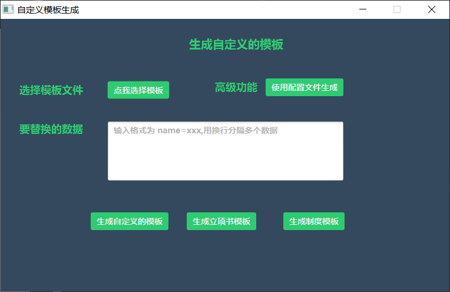

# 用javafx做的一个word模板替换工具

> 目前只在windows10上用过

**桌面的 daTemplate 文件夹就是存放模板和配置文件的地方 daTemplate/config/da.txt 就是配置文件 配置文件的第一行 [template]=xxx,xxx 用,分割开存放多个模板的目录 其余的行用
key=value 格式来写要替换的内容,一行对应一个数据**

## 界面首页

